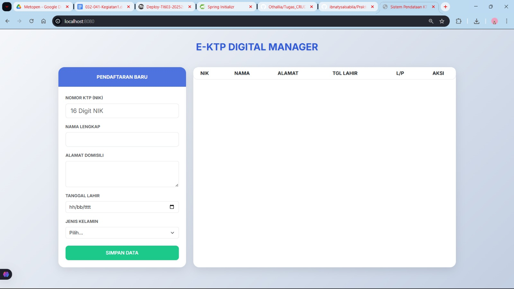
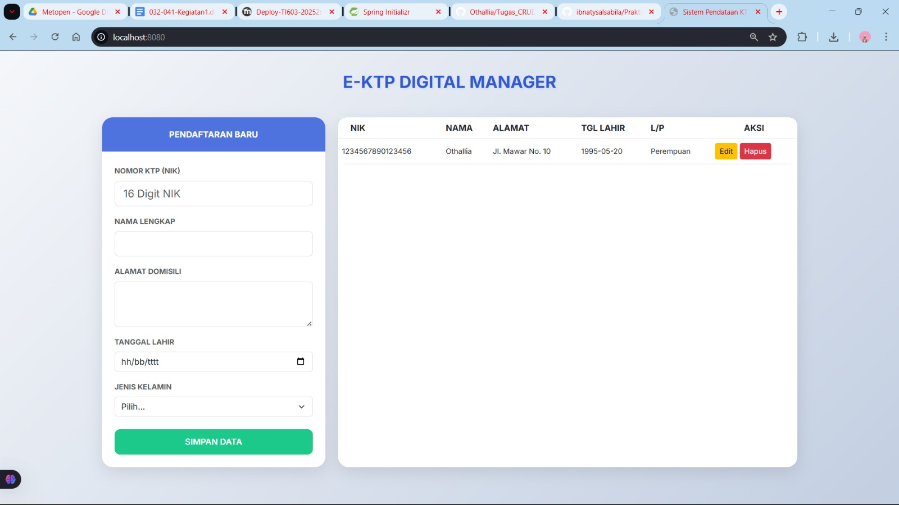
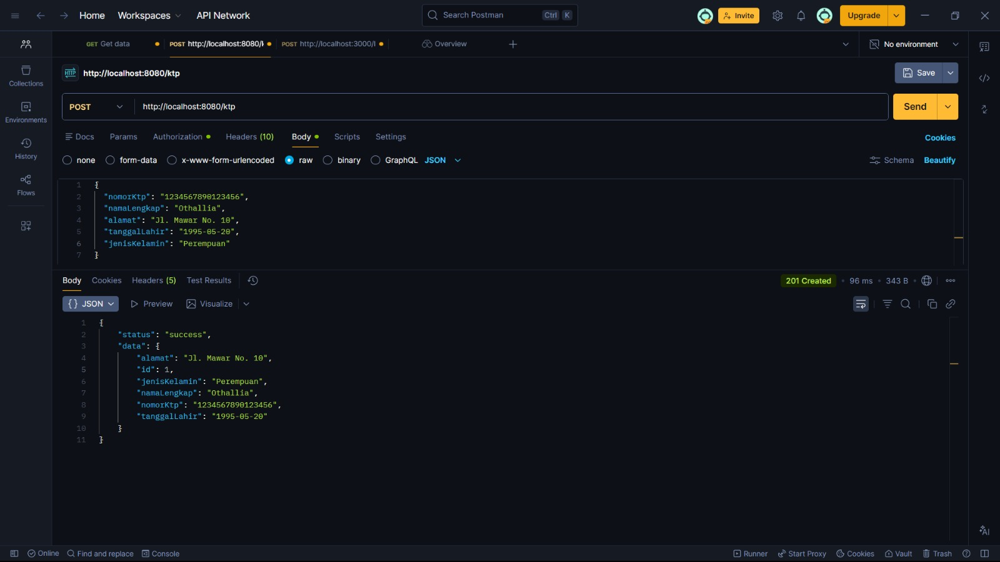
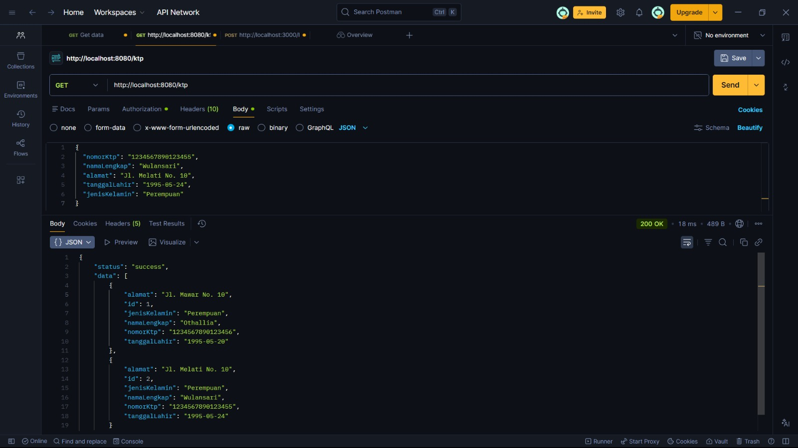
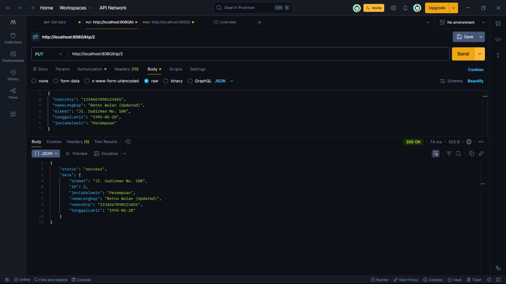
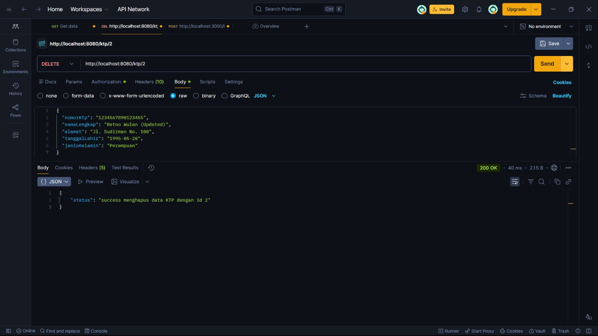

### 1. Tampilan Web Utama
Ini adalah tampilan awal aplikasi saat dijalankan di browser.

### 2. Sesudah Tambah Data
Tampilan tabel setelah data berhasil diinput melalui form.

---

## 🧪 Pengujian API (Postman)

### A. POST - Tambah Data

### B. GET - Ambil Data

### C. PUT - Update Data

### D. DELETE - Hapus Data

